This is how we built [SignYourName.io](https://signyourname.io/sign?model=model1), a web app that teaches people to sign their names in ASL.

<div align="center">
  
</div>

## The Initial Approach (V1): Proof of Concept

Our first goal was simple: Build a web app that classifies sign language letters from a webcam feed?

For starters, we would need to train and host an image classification model, one that could take a static image of a hand sign and generate a letter prediction.

<div align="center">
  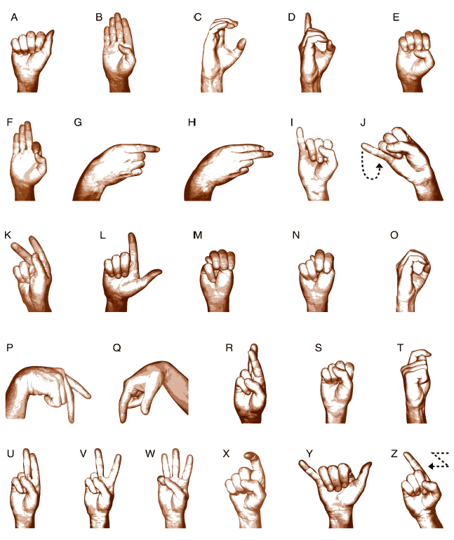
</div>

Instead of creating these models entirely from scratch, we opted to fine tune existing image classification models.

### Why Fine-Tuning?

Fine-tuning is the process of taking a pre-trained model—(pre-trained on a similar problem)—and continuing its training for your specific use case.

We chose 4 different models that were already trained to recognize and classify images (but not specifically sign language letters):

- Inception_V3
- MobileNet v3 Large
- EfficientNet v2
- ResNet152

All these models use **CNN architecture (convolutional neural nets)**. CNNs work by applying convolutional filters to detect features like edges, textures, and patterns. They're a cornerstone of computer vision—simple, powerful, and a great first move for image classification.

### Data Generation: Enabling the Fine Tuning

Fine tuning (and training of any kind) requires training data.

To generate this data, we created an internal tool that allowed our team to generate thousands of hand images and labels for our project.

<div align="center">
  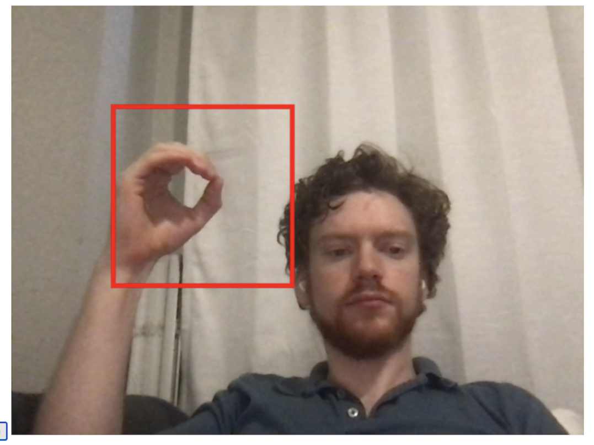
</div>

To use this tool, users positioned their hand within a red onscreen bounding box and held down the corresponding keyboard letter. While pressed, the program rapidly captured multiple images per second at the precise dimensions our model required, automatically saving them to the appropriate letter directory for labeling.

In total, we captured over **24,000 images** across different letters and developers.

### Training: Making a Model Work

After setting up the models and generating our data, all that was left was training, validating, and testing out!

We configured our models to process 224x224x3 images. The dataset was divided using an 80/10/10 split: 80% for training, 10% for validation during training, and 10% for final testing.

For training, we used categorical cross-entropy as our loss function since we were dealing with a multi-class classification problem. We paired this with the Adam optimizer starting with a learning rate of 0.001.

After a few cycles, the best-performing model achieved 82% accuracy on our test dataset under controlled conditions. However, letters with similar configurations (like 'M' and 'N') showed higher confusion rates, highlighting areas for improvement.

### Early UX: Our First Functional Screen

With our models trained, we built a basic architecture to actually use them on our web app.

<div align="center">
  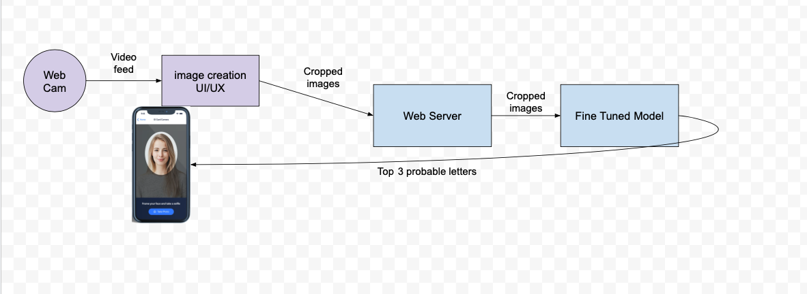
</div>

We hosted the model on sagemaker and built a basic API server and frontend with nextjs and React.

And with that we had our proof of concept! And _**technically**_, it worked!

<div align="center">
  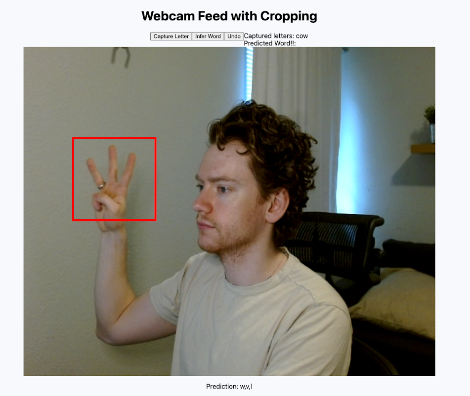
</div>

But it exposed major weaknesses in our approach.

### 1: Poor Adaptability

- The system completely failed when faced with different backgrounds, skin colors or lighting conditions. Additionally, squeezing your hand into a little red box was a terrible user experience.

### 2: No Motion Signs

- Our system completely failed when trying to classify signs that require motion (J and Z).

### 3: Low Accuracy

- On live tests, we scored BARELY over 50% accuracy!

### 4: Very Slow

- 3000ms+ for a response!

## Our Solutions

### Solving #1: "Poor Adaptability"

Our models required standardized input, and we solved this by putting the burden on the user "put your hand in this little box"

But it was a HEADACHE. We needed to allow users the freedom to put their hand ANYWHERE in the frame and be confident it was being tracked.

And we needed to be confident we would recognize the hand even if the lighting was dim, or there was a busy background!

To accomplish this, we moved away from a one model approach, and implemented a second model to pre-process a webcam feed into clean, standardized data!

We chose **[MediaPipe Hands](https://mediapipe.readthedocs.io/en/latest/solutions/hands.html)**, an open-source tool by Google that tracks 21 hand landmarks in real-time.

<div align="center">
  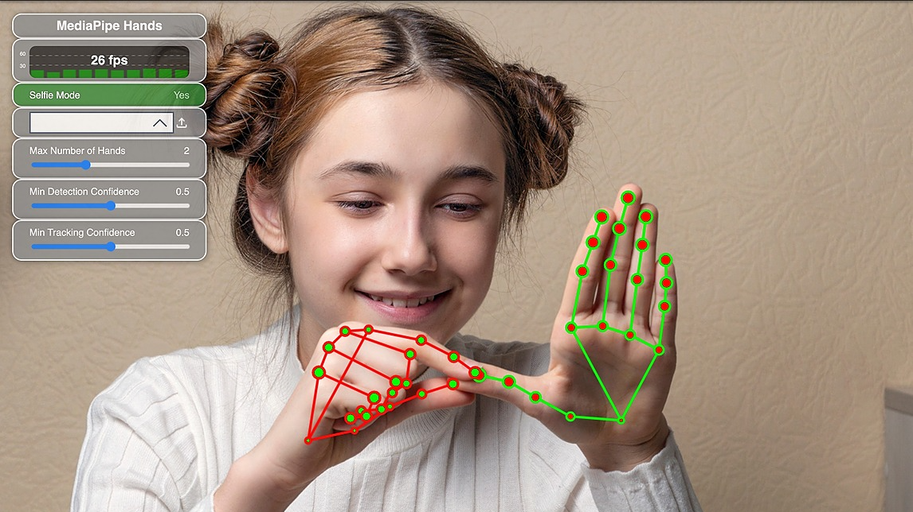
</div>

By converting raw images to 3D landmark data, we:

- Track the hand anywhere on the screen
- Improved robustness across lighting and skin tones
- Completely ignored busy background

This was a huge improvement!

### Solving #2: "No Motion Signs"

The static models we had trained could only classify single images. This was a MAJOR problem for our use case, why?

Because in the sign language alphabet, not all letters are static images!

Let's consider the letters I and J.

<div align="center">
  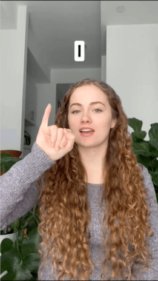
  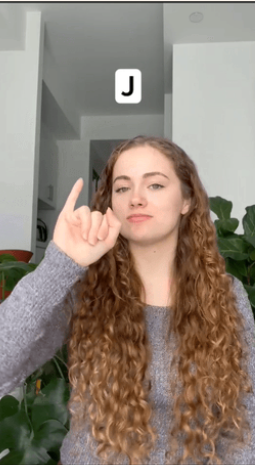
</div>

Initially they look the same, and our CNNs would treat them equally. **However**, once we bring in motion, it's clear they represent 2 different letters.

<div align="center">
  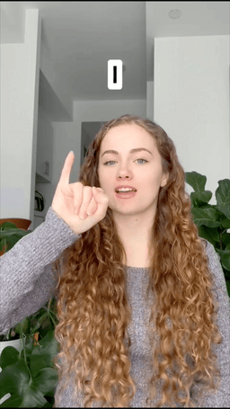
  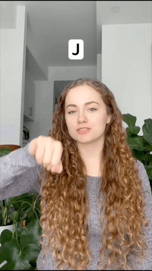
</div>

**The problem:** CNNs are stateless—they treat each frame in isolation with no memory of prior frames.

<div align="center">
  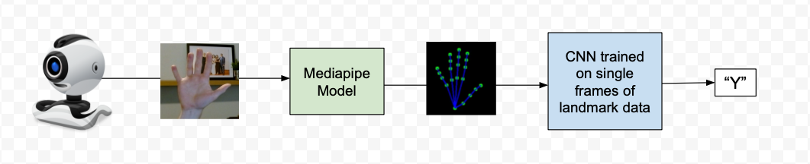
</div>

But motion requires understanding **sequences**.

That's when we moved to stateful models.

Stateful models pass some part of the previous output back INTO the model on the next iteration, giving the model additional historical features to begin to understand and predict.

Which was PERFECT for our use case of multiple sequential images (frames)

<div align="center">
  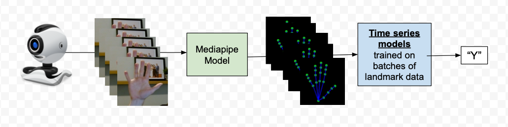
</div>

We replaced our CNNs with a variety of time series models:

- MultiLSTM (Long Short-Term Memory) networks
- SingleLSTM configurations
- CNN-GRU (Convolutional Neural Network with Gated Recurrent Units)

**Extra credit note:**
We spent a lot of time experimenting with frame batching (Analyzing sequences of 10, 30, or 60 frames at once) and buffer / sliding window techniques (Maintaining a continuous stream of recent frames for analysis), which I won't go into here, but they are fascinating pieces of this puzzle.

### Solving #3: "Low Accuracy"

Next challenge: hand position within the frame dramatically impacted results. Even though MediaPipe gave us hand landmark coordinates instead of an image, these coordinates could still vary dramatically based on their image in the frame.

For an example, let's take 2 frames of MediaPipe hand landmark data, and render them as images using [CV2](https://mediapipe.readthedocs.io/en/latest/solutions/hands.html#python-solution-api)

<div align="center">
  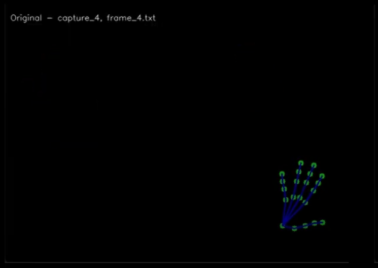
</div>

<div align="center">
  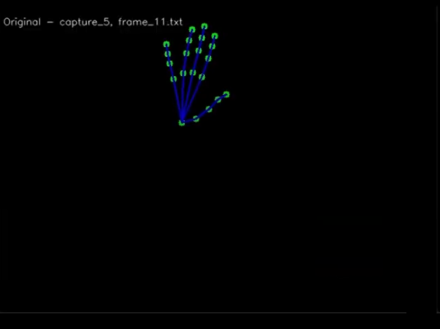
</div>

These 2 captures represent someone holding the exact same hand position (a high five), BUT in 2 different locations of the capture area.

So even though the captured landmark data SHOULD be similar since the hand landmarks are similar relative to the rest of the hand, they're actually very DIFFERENT in absolute sense.

This makes it even harder for the model to start to recognize patterns, since it has all this extra noise of absolute hand position (how far from center) and scale of hand (how close to camera)

We solved this with two normalization techniques:

1. **Scale Normalization:** Resize all hand landmarks so the hand has a consistent "size" across frames.
2. **Position Normalization:** Center the hand by shifting all landmarks so the centroid sits at (0,0).

For the coders, here is what centering looks like! It's very similar to calculating the average from a list of integers.

```javascript
export const centerFrame = (frameCoordinates) => {
  let centroidX = 0,
    centroidY = 0,
    centroidZ = 0;

  // Sum up the positions of all coordinates
  for (const { x, y, z } of frameCoordinates) {
    centroidX += x;
    centroidY += y;
    centroidZ += z;
  }

  // Divide by the number of coordinates to get the centroid
  const n = frameCoordinates.length;
  centroidX /= n;
  centroidY /= n;
  centroidZ /= n;

  // Shift each coordinate by subtracting the centroid
  return frameCoordinates.map(({ x, y, z }) => ({
    x: x - centroidX,
    y: y - centroidY,
    z: z - centroidZ,
  }));
};
```

After running the re-centering the hand (code above) and scaling it (code not shown), it looks like this:

<div align="center">
  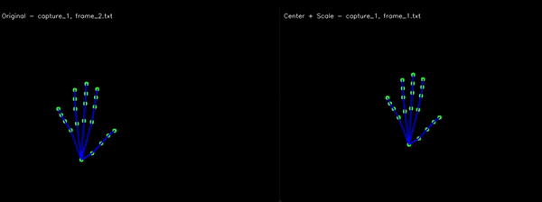
</div>

(left is original, right is normalized)

We ran all frames through this normalizer process before training and before prediction.

These improvements boosted accuracy by roughly 15%

### Solving #4: "Very Slow (3000ms+ for a Response)"

For our application, speed was absolutely critical. Hand spelling happens quickly, and expecting a user to wait even 2 seconds was unacceptable.

One option was to move the model away from sagemaker hosting, and use it directly on the user's browser.

In theory, this could improve speed, but only if the model is lightweight enough.

In our case, the models we created were EXTREMELY lightweight.

Here is one example of one of the actual LSTM model with only 4 layers:

```
input(10,63) → LSTM(128) → Dense(64,relu) → Dense(26,softmax)
```

As a result, there were ~108k parameters, with file size not over 433kb! This should work!

To actually use the model on the browser, we followed the tutorial from [tensorFlow's website](https://www.tensorflow.org/js/guide/conversion) to convert the Keras model to tensorflowJS.

The front end implementation was as follows:

- Load mediapipe hands libraries and model via their CDN
- Load our model config and weights as static assets
- Stream the webcam video feed to mediapipe predict function
- On mediapipe results,
  - normalize the hand data,
  - pass hand data to our model for prediction
  - Return top result

With this refactor, inference time moved from 3000 ms on average to **400 ms!**

With this final change, we had solved our technical problems, but we still had one more loose thread.

## "What's the Point??"

After technical success, we had to answer: what's the value of this app?

Our app only recognized finger spelling. NOT words, not sentences, just letters. And when are letters even used in ASL? It turns out that letters are generally used for proper nouns: names, places, brands.

How could we turn this limit into something useful? Within these constraints we found our purpose:

**how to sign your own name.**

With this pivot, we felt our app could actually have a real positive impact. Introducing yourself is a critical part to any social interaction and requires actually knowing how to sign your own name!

We recruited the help of product designer [Marcela Akey](https://marcelaakey.com/) to make our vision a reality. Then we rolled up our sleeves, put in some web development work, and transformed our tech demo into an app that can actually teach you something useful!

## The Final Product: SignYourName.io

After a total of three months, we launched the app!

<div align="center">
  
</div>

Looking back on this journey, building SignYourName.io revealed the unique challenges of applying ML to real-time gesture recognition.

From our initial CNN proof-of-concept to the final browser-based implementation with MediaPipe and lightweight LSTM networks, each iteration taught us something valuable about real-time vision.

While our app handles only finger spelling, we hope it serves a useful proof of concept in the broader landscape of accessibility tools.

If you're interested, try SignYourName.io and experience the results firsthand.

**Try it yourself:** [SignYourName.io](https://signyourname.io/sign?model=model1)

_Disclaimer: This app is an educational tool and not a substitute for formal ASL instruction._
